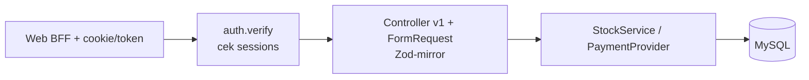

# PRD Backend — Delysa Florist (`apps/api`)

> Tech Lead Architect → **Dev BE (1 orang)**. Scope tegas: **hanya `apps/api`**.
> Dilarang menyentuh `apps/web/`. `packages/shared/openapi.yaml` hanya diubah via
> protokol Bridge. **Status: kode dikosongkan dulu** (keputusan user) — dokumen ini
> adalah acuan saat scaffold dimulai (Laravel 11 + MySQL di VPS/laptop BE).
> Induk: `PRD-Delysa-Florist.md` (general). Konsumen: Dev FE via kontrak.

## 1. Executive Summary

- **Problem Statement:** Tanpa API, tidak ada katalog live-stock, reservasi stok atomik,
  verifikasi pembayaran terdokumentasi, dan laporan — semua masih manual via WA.
- **Proposed Solution:** Laravel 11 REST JSON (`/api/v1`) sebagai satu-satunya otoritas
  bisnis: katalog, order, pembayaran manual, stok transaksional (`StockService`),
  laporan; verify sesi read-only lawan tabel Better Auth milik web.
- **Success Criteria (KPI):**
  1. 100% endpoint kontrak lolos contract test (respons cocok `openapi.yaml`).
  2. Checkout p99 <1 dtk @50 concurrent (k6); stok tidak pernah negatif diuji race.
  3. `composer test` (phpunit) hijau; 0 migrasi irreversible tanpa dokumen rollback.
  4. `GET /api/v1/health` 200 di semua environment.
  5. 0 bug kritis alur order→stok→status saat integrasi.

## 2. Fungsionalitas (konsumen = Dev FE + Admin via FE)

**User Stories (sisi BE) + Acceptance Criteria:**

- Sebagai FE, saya ingin `GET /products?search=&category=&page=` agar katalog tampil —
  AC: pagination 20/page, filter benar, produk stok-0/`isActive=false` tidak dikembalikan,
  respons cocok skema `Product` kontrak, <1 dtk untuk 10k rows (index).
- Sebagai FE, saya ingin `POST /orders` atomik agar tidak oversell —
  AC: cek `stock - reservedStock >= qty` dalam transaction + `lockForUpdate`;
  kurang → `409 {code: STOCK_INSUFFICIENT}`; sukses → order `pending_payment` + kode `DLF-…`.
- Sebagai FE, saya ingin upload bukti + `PATCH /admin/payments/:id/verify` agar
  pembayaran terdokumentasi — AC: file jpg/png ≤5MB (signed URL), verify→`paid` +
  decrement final + `stock_movements(sale)`; reject wajib alasan + restore.
- Sebagai FE, saya ingin `PATCH /admin/orders/:id/status` + riwayat agar tracking jalan —
  AC: transisi status tervalidasi (state machine, tolak lompatan ilegal), tercatat waktu+aktor.
- Sebagai FE, saya ingin `GET /admin/reports/sales?from=&to=` + dashboard agregat —
  AC: laporan 1 bulan <3 dtk, angka cocok dengan query audit langsung.
- Sebagai FE, saya ingin `POST /api/v1/auth/verify` agar setiap request terautentikasi —
  AC: token valid → `{user{id, role}}`; kedaluwarsa → 401; non-admin ke `/admin/*` → 403.

**Non-Goals BE:** tanpa UI/blade, tanpa menulis tabel `user/session/account/verification`
(Better Auth writer tunggal di web — Laravel **read-only**), tanpa gateway live (stub
`PaymentProviderInterface` + `ManualProvider`), tanpa data kartu.

## 3. AI System Requirements

Tidak berlaku.

## 4. Technical Specifications

**Stack terkunci:** PHP 8.2+, Laravel 11, MySQL 8, phpunit 11, Docker Compose
(api + db) untuk VPS. Prefix route `/api/v1`. Format error konsisten
`{message, code}` (lihat kontrak `Error`).

**Skema data (otoritas BE; mirror `constants.ts` shared):**

```mermaid
erDiagram
  user ||--o{ session : has
  user ||--o{ orders : places
  categories ||--o{ products : contains
  products ||--o{ order_items : includes
  products ||--o{ stock_movements : tracks
  orders ||--o{ order_items : has
  orders ||--|| payments : has
  orders ||--o{ stock_movements : causes
  user {
    string id PK
    string email UK
    string role
  }
  products {
    int id PK
    int price
    int stock
    int reservedStock
    int lowStockThreshold
    bool isActive
  }
  orders {
    int id PK
    string code UK
    string status
    int total
  }
  payments {
    int orderId FK_UK
    string status
    string proofImageUrl
  }
  stock_movements {
    int productId FK
    string type
    int qtyChange
    int stockAfter
  }
```

**Invarian (wajib, di `StockService`, 1 code-path):**
`reserve` (cek + `reservedStock+=qty`) → `commitSale` (`stock-=qty`,
`reservedStock-=qty`, insert `sale`) atau `restore` (`reservedStock-=qty`, insert
`restore`). Semua dalam DB transaction + `SELECT … FOR UPDATE`. `CHECK (stock >= 0)`.

**Alur request (BE view):**



**Aturan keras BE:**

1. Request divalidasi di FormRequest yang mirror `schemas.ts` shared (nama field identik).
2. Setiap perubahan kontrak (field/status/error baru) = update `openapi.yaml` DULU
   via protokol Bridge, bukan langsung di code.
3. Migrasi reversible; seed: 5 kategori + 12 produk + 1 admin + 2 customer fiktif,
   lalu data asli Delysa (Fase 5).
4. Log bermakna tanpa PII/password; bukti TF via signed URL 15 menit.

## 5. Risks & Roadmap + Fase, Requirement, Metrik, Timeline

**Fase BE-0 Scaffold (pra-Fase 1):** FR: Laravel 11 + `/api/v1/health`, koneksi MySQL
bersama web, CI job api hijau. NFR: `.env` tidak di-commit.
**Fase BE-1 Auth verify (Fase 1):** FR: `auth/verify`, middleware role, reset via
`verification` read. NFR: rate-limit login 5x/mnt/IP, token 256-bit.
**Fase BE-2 Katalog (Fase 2):** FR: CRUD produk+kategori admin, upload ≤2MB,
list/search/filter. NFR: index `FULLTEXT(name)`, response <1 dtk.
**Fase BE-3 Order+Payment (Fase 3):** FR: cart persist (opsional tabel), order atomik,
payment-proof, verify/reject. NFR: p99 <1 dtk @50 concurrent, idempotency-key.
**Fase BE-4 Stok+Laporan+Review (Fase 4):** FR: state machine status, `stock_movements`
lengkap, dashboard agregat, laporan+CSV, review pasca-`delivered`. NFR: laporan <3 dtk.
**Fase BE-5 Gateway-ready+Deploy (Fase 5):** FR: `MidtransProvider` stub + webhook route
(flag OFF), seed asli, backup harian + uji restore. NFR: uptime 99.5%, TLS.

**Risiko BE:** dual-truth user table (mitigasi: read-only + fallback Sanctum bila stuck
>1 sprint — lihat PRD general §9); race stok peak (transaction+lock+k6); drift kontrak
(mitigasi: contract test CI — lihat Bridge).

**Estimasi (paralel dengan FE):** BE-0 W1, BE-1 W1–2, BE-2 W3, BE-3 W4, BE-4 W5, BE-5 W6,
buffer W7. Urutan vs FE ada di `PRD-Bridge-Delysa-Florist.md` (baca itu dulu).
