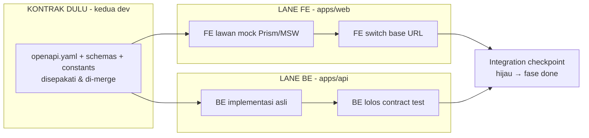
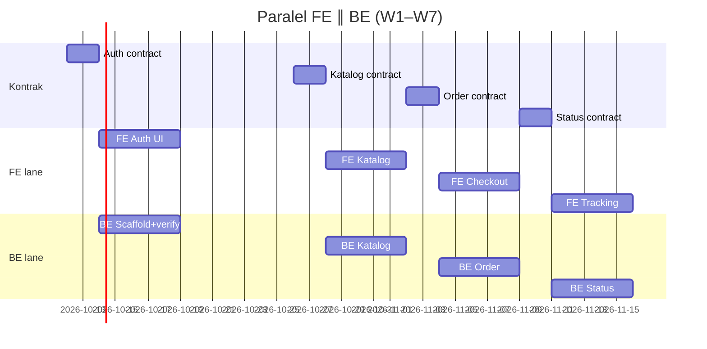

# PRD Bridge — Integrasi FE ↔ BE Delysa Florist

> Tech Lead Architect → **Dev FE + Dev BE**. Dokumen ini adalah **satu-satunya acuan
> urutan kerja paralel**: siapa kerjakan apa duluan, kontrak apa yang mengikat,
> dan bagaimana merge tanpa bentrok. Konflik dengan dokumen ini = PR ditolak.
> Induk: `PRD-Delysa-Florist.md`. Sisi: `PRD-Frontend-*`, `PRD-Backend-*`.
> Tracker: **GitHub Issues**. Tim: 1 FE (`apps/web`) + 1 BE (`apps/api`).

## 1. Executive Summary

- **Problem Statement:** Dua dev mengerjakan satu monorepo; tanpa urutan dan kontrak
  yang dikunci, FE menunggu BE (idle), tipe drift, dan merge conflict di area bersama.
- **Proposed Solution:** Kontrak OpenAPI disepakati per fase DULU, lalu FE (lawan mock)
  dan BE (implementasi asli) jalan paralel di lane folder masing-masing, integrasi
  via ganti base URL + contract test; isu GitHub bernomor dengan dependensi eksplisit.
- **Success Criteria (KPI):**
  1. Zero idle blocking: tidak ada issue FE/BE yang blocked >1 hari kerja menunggu sisi lain.
  2. Contract drift = 0 (CI `gen:types` + contract test hijau di setiap PR).
  3. Zero merge conflict di `packages/shared` di luar PR kontrak yang disepakati.
  4. Tiap fase ditutup integration checkpoint hijau (dev lawan BE staging).

## 2. Prinsip Paralelisme (dari riset)

API-first (GitScrum, Swagger, Strapi): kontrak = source of truth → FE lawan mock,
BE implementasi asli → integrasi = ganti base URL. Scope lanes (Mergify, GSD, ADD):
PR/CI per-scope (`apps/web`, `apps/api`) merge paralel; PR lintas-scope (kontrak)
butuh kedua sisi. Detail di chat riwayat riset Tahap 1.

## 3. Matriks Kontrak per Fitur (ringkas; detail di `openapi.yaml`)

| Fitur | Endpoint (BE owns) | Konsumen FE | Mock |
|---|---|---|---|
| Health | `GET /api/v1/health` | boot check | ya |
| Katalog | `GET /products?search=&category=&page=` | PLP/PDP | ya |
| Produk admin | `POST/PATCH/DELETE /admin/products` | CRUD produk | ya |
| Order | `POST /orders` (409 `STOCK_INSUFFICIENT`) | checkout | ya |
| Bukti bayar | `POST /orders/:id/payment-proof` | upload | ya |
| Verifikasi | `PATCH /admin/payments/:id/verify` | admin bayar | ya |
| Status order | `PATCH /admin/orders/:id/status`, `GET /orders` | tracking | ya |
| Laporan | `GET /admin/reports/sales`, dashboard agregat | dashboard | ya |
| Review | `POST /products/:id/reviews` | PDP | ya |
| Auth verify | `POST /api/v1/auth/verify` (internal) | BFF guard | ya |

Aturan: endpoint baru/ubah field = update `openapi.yaml` + `schemas.ts` + `constants.ts`
dalam **satu PR kontrak** (label `contract`), di-review & approve **kedua dev**,
lalu `gen:types` dijalankan ulang. Di luar PR kontrak, `packages/shared` read-only.

## 4. Daftar GitHub Issues + Dependensi (urut eksekusi)

Buat issue dengan nomor berikut (owner = assignee). `→` = blocks/depends.

1. **#1 `[contract] Kontrak Auth + guard`** (keduanya) → membuka #2, #3.
2. **#2 `[FE] Auth UI + guard /(admin)`** (FE, mock sesi) — paralel dengan #3.
3. **#3 `[BE] Scaffold + auth.verify + seed`** (BE) — paralel dengan #2.
4. **INT-1 checkpoint Auth** (FE lawan BE staging hijau) → membuka #5.
5. **#5 `[contract] Kontrak katalog+produk`** (keduanya) → #6, #7.
6. **#6 `[FE] PLP/PDP + admin produk UI`** (FE, mock) ∥ **#7 `[BE] CRUD + list/search`** (BE).
7. **INT-2 checkpoint katalog** → #9.
8. **#9 `[contract] Kontrak order+payment`** → **#10 `[FE] cart+checkout+upload`**
   ∥ **#11 `[BE] order atomik + verify`** → **INT-3**.
9. **#13 `[contract] Kontrak status+laporan+review`** → **#14 `[FE] tracking+dashboard`**
   ∥ **#15 `[BE] state machine + agregat`** → **INT-4**.
10. **#17 `[bridge] Gateway stub + deploy + UAT/SUS`** (keduanya) → DONE.

Aturan dependensi: issue `∥` boleh dikerjakan bersamaan sejak PR kontraknya merge;
issue `INT-*` tidak mulai sebelum kedua sisi hijau; tidak ada issue FE yang menunggu
implementasi BE (selalu ada mock).

## 5. Definition of Ready / Done (mengikat)

**DoR issue FE:** kontrak endpoint-nya merge + mock tersedia + tipe ter-generate.
**DoR issue BE:** kontrak merge + migrasi dirancang (reversible).
**DoD FE:** `vite build && tsc --noEmit` exit 0 + 5 state UI + e2e/lawan-mock hijau +
tanpa tipe API lokal + tanpa secret di bundle.
**DoD BE:** `composer test` hijau + contract test cocok `openapi.yaml` + respons error
`{message, code}` + tanpa tulis tabel auth + migrasi reversible.
**DoD INT:** FE switch base URL ke BE staging, seluruh AC fase hijau end-to-end.

## 6. Aturan Anti-Bentrok (kepemilikan + CI)

1. **Kepemilikan folder (CODEOWNERS):** `apps/web/` = FE, `apps/api/` = BE,
   `packages/shared/` = keduanya (wajib 2 approvals). PR menyentuh folder orang lain
   tanpa izin = ditolak.
2. **Branch:** `feat/web-*`, `feat/api-*`, `chore/contract-*`. Satu PR = satu scope;
   dilarang PR campur `web+api` kecuali PR kontrak.
3. **CI lanes:** job `web` dan `api` independen via `paths-filter` (sudah ada di
   `.github/workflows/ci.yml`); PR kontrak menjalankan keduanya + `gen:types` check.
4. **Mock:** FE men-switch via env `VITE_API_URL` (mock Prism/MSW vs BE staging vs
   produksi) — tanpa ubah kode saat integrasi.
5. **Konflik kontrak:** bila BE butuh ubah respons, buka PR kontrak baru + minor version
   di `openapi.yaml`; FE menyesuaikan di issue terpisah. Dilarang "fix diam-diam".

## 7. Risiko Bridge + Timeline

Risiko: kontrak terlambat (mitigasi: timebox 1–2 hari per kontrak, mulai dari endpoint
tersempit); drift tipe (mitigasi: CI); integrasi menumpuk di akhir (mitigasi: INT per
fase, bukan sekali di W6); `apps/api` kosong sampai BE mulai (mitigasi: mock menutup
gap — FE tidak pernah blocked).

Langkah pertama besok: buat issue #1–#3 dari §4, sepakati kontrak Auth, lalu kedua
lane jalan paralel. File ini + 2 PRD sisi dibaca wajib sebelum sprint planning.
