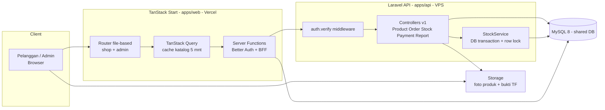
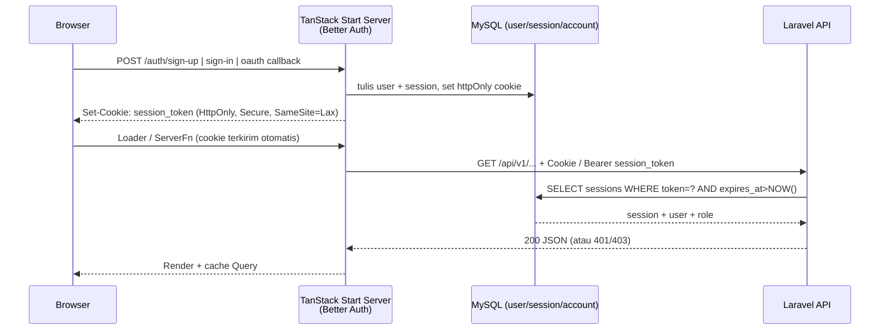
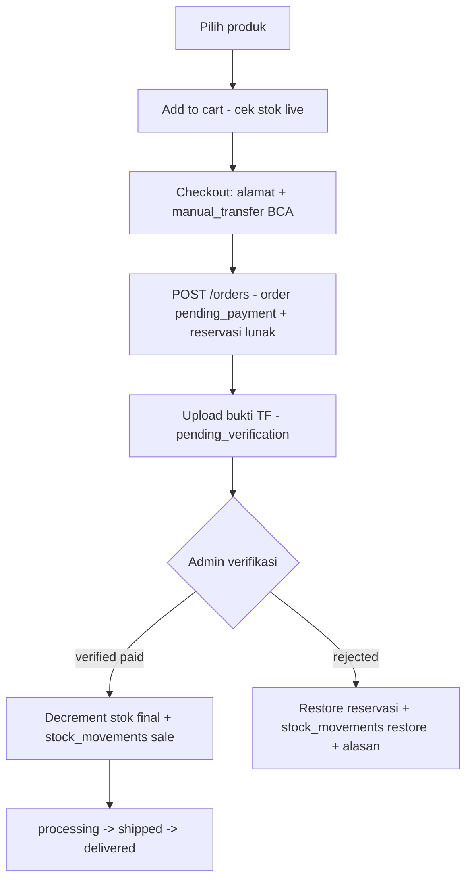
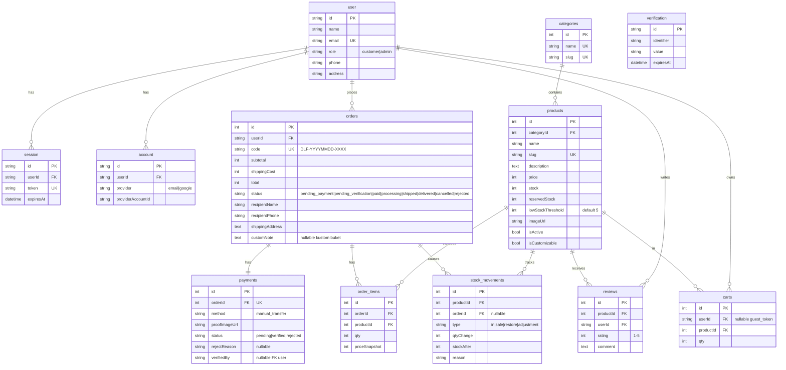

# PRD — Sistem E-Commerce Terintegrasi Delysa Florist

> **Peran dokumen:** Tech Lead Architect → tim Capstone (4 orang)
> **Versi:** 1.0 — 8 Okt 2026 | **Status:** Siap eksekusi
> **Sumber:** `Capstone Project Delysa Florist.docx` (Univ. Siliwangi, 2026) + hasil klarifikasi stack + riset Exa
> **Lokasi proposal:** folder ini (`Capstone Project Delysa Florist.docx`)

---

## 0. Keputusan Arsitektur Mengikat (hasil klarifikasi user)

| Area | Keputusan final |
|---|---|
| Repo | **Monorepo Opsi A: pnpm workspaces saja, TANPA Turborepo.** Alasan: tim 4 orang, 2 apps + 1 shared, 1 app PHP tidak dapat benefit task-graph/caching Turbo. Orchestrasi via `package.json` root + `concurrently` + `pnpm -r`. |
| Struktur | `apps/web/` (TanStack Start) + `apps/api/` (Laravel 11 REST API) + `packages/shared/` (OpenAPI + generated types + Zod schemas). Aturan deps: `web → shared ← api`, dilarang cyclic. |
| Frontend | TanStack Start + TanStack Router (file-based) + TanStack Query + Tailwind CSS + shadcn/ui + Zod + React Hook Form. Tanpa Inertia.js (decoupled). |
| Backend | Tetap **Laravel 11 API + MySQL 8** sesuai proposal. Mode REST JSON (`/api/v1/...`), OpenAPI 3.1 sebagai kontrak tunggal di `packages/shared/openapi.yaml`. |
| Auth | **Better Auth** (pilihan user). Dijalankan di **sisi `apps/web` server (Server Functions)**, bukan di Laravel — karena Better Auth adalah library Node.js dan tidak bisa host di PHP. Laravel hanya verify read-only via tabel `sessions` bersama / endpoint `GET /api/v1/auth/verify`. Mendukung email+password, Google OAuth (feature-flag). |
| UI / Deploy | Tailwind + shadcn/ui. `web` → Vercel, `api` + MySQL → VPS Docker. Satu route group `/(shop)` + `/(admin)` dalam satu codebase `apps/web`. |
| Pembayaran MVP | **Hybrid:** manual transfer BCA + upload bukti + verifikasi admin di v1. Abstraksi `PaymentProviderInterface` disiapkan untuk Midtrans/Xendit di fase lanjut (stub OFF). |
| Metodologi | Tetap Scrum sesuai proposal (Product Owner, Scrum Master, Dev Team, Product/Sprint Backlog, Increment, Review, Retrospective). PRD ini = Product Backlog yang sudah diprioritaskan. |

Struktur Opsi A:

```text
delysa-florist/  (root repo ini)
  apps/
    web/                  # TanStack Start, Better Auth server, shop + admin UI
      src/routes/(shop)/  # katalog, detail, cart, checkout, orders
      src/routes/(admin)/ # dashboard, products, orders, stock, reports
      src/lib/auth.ts     # better-auth config
    api/                  # Laravel 11, REST JSON, StockService transaksional
      app/Http/Controllers/Api/V1/
      routes/api.php
  packages/
    shared/               # SINGLE SOURCE OF TRUTH
      openapi.yaml
      src/types.gen.ts    # hasil openapi-typescript, jangan edit manual
      src/schemas.ts      # zod schemas (mirror backend FormRequest)
      src/constants.ts    # order status, roles
  pnpm-workspace.yaml     # packages: apps/*, packages/*
  package.json            # scripts root: dev, build, lint, test, gen:types
```

Root `package.json` (konsep, tanpa Turbo):

```json
{
  "scripts": {
    "dev": "concurrently \"pnpm --filter web dev\" \"pnpm --filter api dev\"",
    "dev:web": "pnpm --filter web dev",
    "dev:api": "pnpm --filter api dev",
    "build": "pnpm -r --filter web... build",
    "lint": "pnpm -r lint",
    "test": "pnpm -r test",
    "gen:types": "pnpm --filter shared gen:types"
  }
}
```

---

## 1. Ringkasan Riset (Exa MCP — landasan requirement)

**A. Monorepo FE+BE satu repo (Graphite guide, CodeLens-AI, fullstack-monorepo-template):**
Pola terbukti: `apps/*` + `packages/shared`, `pnpm-workspace.yaml`, lockfile tunggal, Git hooks di root, CI split per-package (skip BE test jika hanya FE berubah). Tanpa Turbo pun pola ini bekerja untuk tim kecil — Turbo hanya menambah value saat >5 paket JS.

**B. Benchmark florist (Acanta, FlowerBaza, PetalPost, Koronet, Fiorefy):**
Wajib tiru: (1) katalog live-stock — item habis otomatis hidden; (2) order storefront langsung masuk antrian/CRM tanpa re-entry manual; (3) `Only X left` saat stok ≤5; (4) low-stock alert + daftar "what to buy"; (5) role-based (sales vs warehouse vs owner); (6) bouquet costing otomatis. Yang TIDAK ditiru di v1: AI forecasting, multi-gudang, FIFO batch-level.

**C. PRD e-commerce standard (Elogic, Vantage, MakeMyPRD):**
Setiap FR wajib ID + Prioritas + Acceptance Criteria terukur. NFR wajib angka: LCP <2.5s (4G), PageSpeed mobile ≥90, checkout p99 <1s, uptime beda untuk checkout vs katalog, cart persist 30 hari (auth) / 7 hari (guest), inventory check ganda (add-to-cart + checkout), price-lock eksplisit.

---

## 2. Latar Belakang & Masalah

Delysa Florist (Jl. Pancasila Lengkongsari, Tawang, Tasikmalaya, sejak 2016, layanan 07.00–21.00 WIB) menjual rangkaian bunga kado/hadiah/ucapan. Operasional hari ini: order via WhatsApp 082116789558 + transfer manual BCA a.n. Kartinah + promosi Instagram @delysafloristt tanpa order via DM.

Kesenjangan (hasil wawancara/observasi proposal Bab 1 & 3):

1. **Tanpa katalog terintegrasi** — pelanggan tidak bisa browse/search/filter mandiri.
2. **Tanpa stok real-time** — pencatatan manual, rentan oversell/understock saat peak (lebaran, musim nikah). Konsisten dengan temuan Nur & Fathoni 2025; N et al. 2026.
3. **Tanpa pesanan & pembayaran terdokumentasi** — konfirmasi via chat, tanpa tracking status, tanpa laporan terstruktur.
4. **Jangkauan terbatas** offline + sosmed, padahal adopsi e-commerce terbukti mendongkrak kinerja UMKM (T et al. 2022) dan Gen-Z prefer order buket daring yang bisa dikustom (N et al. 2026). Studi acuan SUS 88 (Excellent) pada migrasi WA→web (Yuniarti & Wahyuningsih 2025; Albalkhi & Komalasari 2024).

Dampak jika dibiarkan: inefisiensi operasional, keterlambatan fulfillment, kehilangan pasar digital.

**Solusi yang diusulkan:** web e-commerce terpadu — katalog terorganisir, keranjang, checkout terdokumentasi, stok real-time via `stock_movements`, pelaporan — dibangun di monorepo Opsi A yang bisa dipelihara 4 mahasiswa dalam 1 semester.

**Non-Goals v1 (tegas, agar tidak melebar):** tanpa loyalty/poin, tanpa multi-bahasa, tanpa aplikasi mobile native, tanpa AI bouquet generator, tanpa multi-cabang/gudang, tanpa COD, tanpa gateway live (stub saja).

---

## 3. Tujuan & Target Pengguna

### 3.1 Tujuan (menjawab Rumusan Masalah proposal)

1. **T1 — Bangun sistem terintegrasi:** katalog + keranjang + pesanan/pembayaran terdokumentasi + stok real-time + laporan (menjawab RM1).
2. **T2 — Buktikan kelayakan:** Black Box ≥90% lulus, UAT ≥80% Sangat Setuju, SUS ≥68 (target 85) (menjawab RM2).

### 3.2 Persona

| Persona | Kebutuhan utama | Konteks pakai |
|---|---|---|
| **Pelanggan B2C** (mahasiswa/pekerja, mobile) | Lihat katalog foto, cari/filter <1 dtk, checkout ≤4 langkah, pantau status, upload bukti mudah | HP Android, 4G, butuh kado dadakan malam/hari libur |
| **Admin/Pemilik** (Kartinah + staff) | Tambah produk, verifikasi bayar, update status kirim, lihat dashboard & laporan | Desktop + HP saat jam toko, peak season |
| **Tim Capstone 4 orang** (PM/Analyst, BE/DB, FE/UI, QA/Docs — Bab 4.3) | Kontrak API jelas, bisa kerja paralel FE/BE, deploy terpisah tanpa blokir | Scrum, branch per paket (`feat/web-*`, `feat/api-*`) |

---

## 4. Arsitektur & Alur Sistem

### 4.1 Alur utama (request → auth → service → DB → response)



Catatan Opsi A: tidak ada layer Turbo. `apps/web` dan `apps/api` di-deploy independen (Vercel vs VPS). Satu-satunya pengikat adalah `packages/shared/openapi.yaml` + CI yang menjalankan `gen:types` dan gagal jika tipe drift.

### 4.2 Alur autentikasi (Better Auth decoupled)



Aturan: Better Auth adalah **satu-satunya writer** tabel `user/session/account/verification`. Laravel **read-only verify**. Sanctum dinonaktifkan agar tidak ada dual-truth.

### 4.3 Alur pemesanan → stok → pengiriman



Kontrak endpoint (`packages/shared/openapi.yaml` = acuan):
`GET /api/v1/health`, `POST /api/v1/auth/verify` (internal), `GET /products?search=&category=&page=`, `POST /cart`, `POST /orders`, `POST /orders/:id/payment-proof`, `PATCH /admin/orders/:id/status`, `PATCH /admin/payments/:id/verify`, `GET /admin/reports/sales?from=&to=`.

---

## 5. Skema Data / ERD

Entitas inti proposal (users, categories, products, orders, order_items, payments, stock_movements) + tabel Better Auth + pendukung (carts, reviews). Bukan skema final, tapi cukup untuk acuan engineering.



**Aturan invarian (wajib di `StockService` Laravel dalam transaction + `SELECT ... FOR UPDATE`):**

- `products.stock >= 0` selalu (CHECK + validasi app).
- Buat order → cek `stock - reservedStock >= qty` → `reservedStock += qty`, status `pending_payment`.
- Verify `paid` → `stock -= qty; reservedStock -= qty;` + `stock_movements(sale)`.
- Cancel/reject → `reservedStock -= qty;` + `stock_movements(restore)`.
- `payments` 1-1 dengan `orders`. Foto/bukti via signed URL 15 menit, bukan public permanen.

---

## 6. Fase Pengembangan & Requirement

### Fase 0 — Setup Project & Environment (P0, W1. Tanpa Turbo. Belum ada fitur bisnis.)

**Fungsional:**

- F0-1: Inisiasi monorepo Opsi A: `pnpm-workspace.yaml` (`apps/*`, `packages/*`), root `package.json` scripts + `concurrently`, `.nvmrc` (Node 20), `.gitignore`, `README.md`, `CODEOWNERS` (FE/BE).
- F0-2: Scaffold `apps/web`: TanStack Start + Router + Query + Tailwind + shadcn/ui init + ESLint/Prettier + `routes/__root.tsx` + `.env.example` (`VITE_API_URL`, `BETTER_AUTH_SECRET`).
- F0-3: Scaffold `apps/api`: Laravel 11 + `routes/api.php` + `GET /api/v1/health → {status:ok}` + `.env.example` + Dockerfile + `docker-compose.yml` (api + MySQL 8).
- F0-4: `packages/shared`: `openapi.yaml` (min. `/health` + `/products`), script `gen:types` (openapi-typescript), `schemas.ts` (Zod), `constants.ts` (role, order status).
- F0-5: Seed awal: 5 kategori + 12 produk dummy + 1 admin + 2 customer fiktif (sesuai Dataset proposal §3.4.6).
- F0-6: GitHub Actions 2 job paralel (tanpa Turbo): `web` (pnpm build + typecheck) dan `api` (composer install + phpunit). Branch protection `main` wajib hijau.

**Non-fungsional:**

- Fresh clone → `pnpm i && pnpm dev` jalan <10 menit (diuji 1 anggota non-author).
- CI p95 <8 menit. Struktur folder terdokumentasi di root README.

### Fase 1 — Autentikasi Better Auth (P0, W1-2)

**Fungsional:**

- FR-AUTH-01: Registrasi email+password (Zod: email valid, password ≥8 char). Duplikat → 409 pesan jelas.
- FR-AUTH-02: Login/logout. Session cookie httpOnly + Secure + SameSite=Lax. Idle 7 hari, absolut 30 hari. Logout invalidate server-side.
- FR-AUTH-03: Google OAuth di belakang feature-flag (boleh mundur ke akhir Fase 1).
- FR-AUTH-04: RBAC `customer|admin`. Loader `/(admin)` redirect `/login` jika tanpa session; middleware Laravel return 401/403 JSON.
- FR-AUTH-05: Reset password via tabel `verification` (dev: log ke console).
- FR-AUTH-06: Halaman login/register + profil dasar (nama, HP, alamat default).

**Non-fungsional:**

- Rate-limit login 5x/menit/IP. Password tidak pernah di-log. Token 256-bit random.
- Login happy-path p95 <800 ms lokal, auth success rate ≥99% (diukur dari log).

### Fase 2 — Katalog, Search, Detail + Admin Produk (P0, W3)

**Fungsional:**

- FR-02-01: Grid 20/page + pagination, badge `Sisa X` jika `stock ≤5`, produk `stock=0 / isActive=false` auto-hidden.
- FR-02-02: Search nama (debounce 300 ms) + filter kategori + sort (termurah/termahal/terbaru). Index `FULLTEXT(name)`, `category_id`.
- FR-02-03: Detail: galeri, deskripsi, stok live, stepper qty (max=stok tersedia), add-to-cart.
- FR-02-04: Admin CRUD produk + kategori + upload foto (jpg/png ≤2 MB) + atur `lowStockThreshold`.

**Non-fungsional:**

- Search <1 dtk untuk 10k rows. LCP <2.5 dtk (4G), PageSpeed mobile ≥90. Cache Query katalog `staleTime` 5 menit. Gambar via Vercel Image optimization.

### Fase 3 — Keranjang, Checkout, Pembayaran Manual (P0 jalur kritis, W4)

**Fungsional:**

- FR-03-01: Keranjang persist 30 hari (auth, DB) / 7 hari (guest, cookie `guest_token`). Tambah/ubah qty/hapus, subtotal auto-recalc.
- FR-03-02: **Inventory check ganda:** saat add-to-cart DAN saat init checkout. Kurang → `409 STOCK_INSUFFICIENT` + info sisa.
- FR-03-03: Checkout 1 halaman ≤4 langkah: review cart → alamat penerima → metode `manual_transfer BCA` → ringkasan + ongkir flat → submit → order `pending_payment` + kode `DLF-YYYYMMDD-XXXX`. Idempotency-key anti double-submit.
- FR-03-04: Halaman instruksi bayar (norek BCA + a.n. Kartinah + total) + upload bukti (jpg/png ≤5 MB) → `pending_verification`.
- FR-03-05: Admin verifikasi: `verified → paid` (trigger decrement final) atau `rejected` (wajib alasan, trigger restore).

**Non-fungsional:**

- Checkout API p99 <1 dtk @50 concurrent (uji k6). Semua mutasi order+stok dalam 1 DB transaction. Tidak simpan data kartu (PCI out-of-scope karena manual).

### Fase 4 — Pesanan, Stok Real-time, Dashboard, Laporan, Review (P0/P1, W5)

**Fungsional:**

- FR-04-01: Pelanggan: riwayat + tracking (`pending_payment → pending_verification → paid → processing → shipped → delivered`). Wajib State Transition Testing tiap transisi.
- FR-04-02: Admin: list order filter status, detail (customer + items + bukti), update status. Dashboard: total order, omzet, produk terlaris, grafik 7/30 hari, order terbaru (sesuai mockup Gambar 3.11–3.15 proposal).
- FR-04-03: Halaman stok: `stock_movements` untuk tiap `in/sale/restore/adjustment`, badge low-stock, halaman "what to buy".
- FR-04-04: Laporan penjualan filter periode + export CSV (PDF stretch).
- FR-04-05: Review/rating 1–5 hanya jika pernah beli (`delivered`), tampil agregat di PDP.
- FR-04-06 (stretch kustom buket): flag `isCustomizable` + textarea catatan di checkout. Bouquet builder penuh ditunda v2.

**Non-fungsional:**

- Laporan 1 bulan <3 dtk. Semua `/admin/*` RBAC ketat + audit `verifiedBy + timestamp`.

### Fase 5 — Gateway-Ready, Hardening, Deploy (P0, W6)

**Fungsional:**

- FR-05-01: `PaymentProviderInterface::createCharge/handleWebhook`. `ManualProvider` aktif, `MidtransProvider` stub (config + route webhook + flag OFF).
- FR-05-02: Deploy: `web` Vercel (env `VITE_API_URL`, `BETTER_AUTH_SECRET`, `BETTER_AUTH_URL`), `api` VPS Docker + MySQL + queue, TLS, seed produk asli Delysa (foto, nama, harga, kategori).
- FR-05-03: Healthcheck, Laravel logs, Vercel Analytics, backup DB harian + uji restore 1x.

**Non-fungsional:**

- Target 99.5% uptime (scope capstone). `.env` tidak di-commit. Bukti TF via signed URL 15 menit.

---

## 7. User Stories & Acceptance Criteria

**Fase 0:** *Sebagai dev, saya ingin `pnpm dev` menjalankan web+api agar onboarding cepat* — AC: fresh clone <10 mnt, `GET /health` 200, `/` render.

**Fase 1:**
- *Sebagai pelanggan, saya ingin register/login agar bisa checkout* — AC: kredensial valid masuk sesuai role; salah password → 401; customer akses `/admin` → 403.
- *Sebagai admin, saya ingin sesi aman* — AC: cookie httpOnly, logout invalidate server-side, 6x gagal diblok 1 mnt.

**Fase 2:**
- *Sebagai pelanggan, saya ingin cari "buket wisuda <100rb"* — AC: filter benar <1 dtk, 0-stock hidden.
- *Sebagai admin, saya ingin tambah produk* — AC: input valid tersimpan + tampil di katalog <1 mnt.

**Fase 3:**
- *Sebagai pelanggan, saya ingin checkout + upload bukti* — AC: data lengkap → order + total benar; bukti terupload → `pending_verification`.
- *Sebagai admin, saya ingin verifikasi bayar* — AC: verify → stok berkurang sesuai qty; reject → restore + alasan tampil ke pelanggan.

**Fase 4:**
- *Sebagai pelanggan, saya ingin lacak pesanan* — AC: status baru tampil <5 dtk setelah admin update.
- *Sebagai pemilik, saya ingin laporan mingguan* — AC: pilih periode → rekap cocok DB, CSV terbuka.
- *Sebagai pelanggan, saya ingin review* — AC: hanya jika `delivered`, agregat tampil di PDP.

**Mapping uji proposal Tabel 3.4:** 7 skenario Black Box (login, katalog, keranjang, checkout, stok, pesanan, laporan) + UAT end-to-end + SUS 10 pernyataan.

---

## 8. Metrik Keberhasilan

**Teknis:** Black Box ≥90% lulus; 0 bug kritis di alur katalog→checkout→stok→pesanan saat deploy; auth success ≥99%; LCP <2.5 dtk; checkout p99 <1 dtk; 5xx <1%.
**Produk/bisnis:** UAT ≥80% Sangat Setuju; SUS ≥68 (target 85 Excellent); 100% produk asli Delysa terunggah; order end-to-end tanpa WA berhasil; waktu rekap laporan <1 mnt (vs manual baseline wawancara).
**Akademik:** 6 luaran Bab 4.4 terpenuhi (sistem + Use Case/Activity/Class/ERD + rekap Black Box + laporan UAT/SUS + user manual + laporan akhir).

---

## 9. Risiko, Asumsi & Ketergantungan

**Risiko riset:** Kompetitor (Acanta/FlowerBaza) jauh lebih matang (FIFO batch, AI forecast) — mitigasi: fokus single-store + manual payment sesuai kebutuhan Delysa, jangan kejar AI.

**Risiko teknis (pilihan user):**

1. **Better Auth + Laravel mismatch (terbesar).** Mitigasi: Better Auth writer tunggal di `apps/web`, Laravel read-only verify; `openapi.yaml` + CI `gen:types` cegah drift; *fallback darurat* yang sudah disetujui arsitek: ganti ke Laravel Sanctum jika stuck >1 sprint tanpa ubah PRD lain.
2. **TanStack Start fast-moving.** Mitigasi: pin versi, upgrade manual.
3. **Cookie cross-domain Vercel↔VPS + CORS.** Mitigasi: `app.*` + `api.*` satu parent domain, `credentials:include`, allowlist ketat.
4. **Upload di Vercel ephemeral.** Mitigasi: wajib object storage / VPS volume, bukan disk lokal Vercel.
5. **Race condition stok saat peak.** Mitigasi: transaction + row lock + single `StockService`, dilarang dua code path update stok. Uji k6.
6. **Opsi A tanpa Turbo = rebuild manual.** Mitigasi: CI split job; jika hanya `apps/web` berubah, job `api` di-skip via `paths-filter`. Disiplin `pnpm --filter`.

**Asumsi:** Mitra sediakan foto/harga/kategori asli; akun BCA tetap; internet toko cukup; tim sesuai Bab 4.3; stack di-lock (tidak ganti DB/framework tengah jalan); Node 20 + pnpm 9 tersedia (PHP/Composer hanya perlu di VPS + 1 laptop BE — PHP tidak ada di laptop ini saat cek env).

**Ketergantungan:** Akun Google OAuth (jika dipakai), domain + VPS, UAT dari Delysa, `pnpm-workspace.yaml` disepakati sebelum Sprint 1.

---

## 10. Timeline & Prioritas

| Minggu | Fase | Owner |
|---|---|---|
| W1–2 | Fase 0 + 1: workspace Opsi A + CI + Better Auth + guard | Semua + BE |
| W3 | Fase 2: katalog + admin produk | FE + BE |
| W4 | Fase 3: cart + checkout + manual payment (jalur kritis) | FE/BE/QA |
| W5 | Fase 4: tracking + stok movements + dashboard + laporan + review | BE/FE |
| W6 | Fase 5 + testing: gateway stub + deploy + Black Box + UAT + SUS | Semua |
| W7 | Buffer: docs (ERD final, API docs, manual), laporan akhir, demo | QA/PM |

MoSCoW: **Must** = auth, katalog, cart, checkout manual, stok real-time, order admin, laporan dasar. **Should** = review, Google OAuth, export PDF. **Could** = Midtrans live, bouquet builder penuh, notifikasi WA otomatis (v2).

---

## 11. Keputusan Tech Lead Final

Opsi A (pnpm workspaces tanpa Turbo) **layak** untuk capstone ini *jika* `packages/shared/openapi.yaml` dijaga sebagai satu-satunya kontrak dan Better Auth tidak diduplikasi di Laravel. Jika session-sharing macet >1 sprint, fallback ke Sanctum diizinkan tanpa revisi PRD lain — cukup ganti implementasi FR-AUTH.

**Butuh konfirmasi sebelum Sprint 1:** (1) setuju Better Auth di `apps/web` + verify di Laravel ini, (2) Google OAuth wajib MVP atau feature-flag, (3) siapa sediakan foto/produk asli + akses Vercel/VPS.
