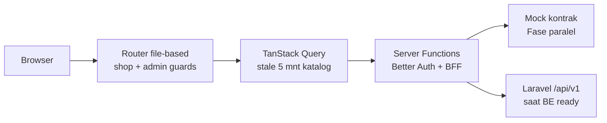
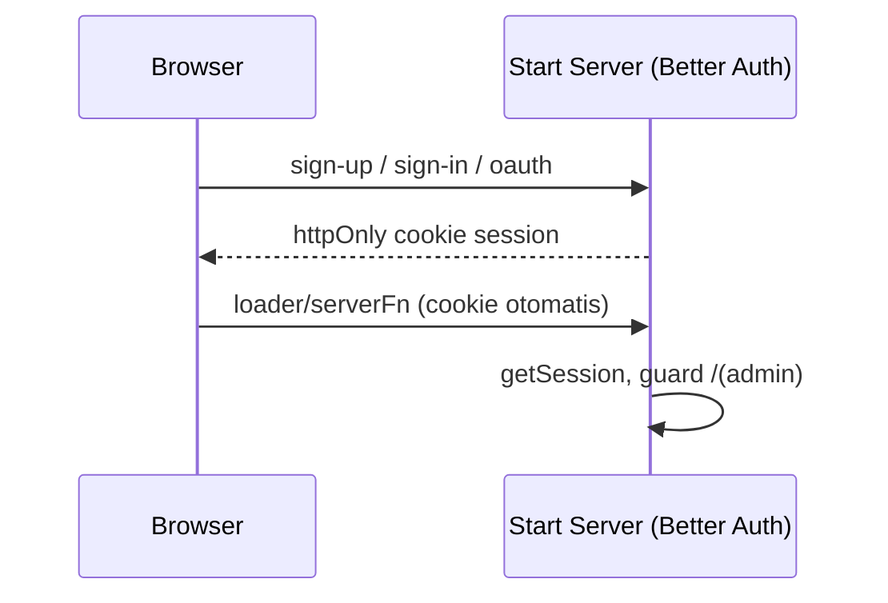

# PRD Frontend — Delysa Florist (`apps/web`)

> Tech Lead Architect → **Dev FE (1 orang)**. Scope tegas: **hanya `apps/web`**.
> Dilarang menyentuh `apps/api/` dan dilarang mengubah `packages/shared/openapi.yaml`
> tanpa protokol Bridge (lihat `PRD-Bridge-Delysa-Florist.md`).
> Induk: `PRD-Delysa-Florist.md` (general). Kontrak: `packages/shared/openapi.yaml`.

## 1. Executive Summary

- **Problem Statement:** Pelanggan Delysa Florist tidak bisa belanja mandiri (order via WA manual)
  dan admin tidak punya dashboard; dibutuhkan shop + admin UI yang konsumsi kontrak API.
- **Proposed Solution:** TanStack Start app (`client-web-delysa-florist`) dengan route shop
  `(shop)` + admin `(admin)`, TanStack Query lawan kontrak OpenAPI (mock dulu, BE asli kemudian),
  Better Auth (client + server functions) untuk sesi.
- **Success Criteria (KPI):**
  1. LCP <2.5 dtk (4G) dan PageSpeed mobile ≥90 di PLP/PDP/checkout.
  2. `vite build && tsc --noEmit` exit 0, 0 TS error, 0 warning code-split TanStack Router.
  3. Seluruh screen utama punya 5 state: loading, empty, error, success, disabled.
  4. e2e Playwright hijau untuk alur katalog → checkout (lawan mock/kontrak).
  5. Tidak ada secret/credential di bundle client (cek CI).

## 2. User Experience & Functionality

**Persona:** (a) Pelanggan B2C mobile Android/4G — cari buket cepat, checkout ≤4 langkah,
pantau status; (b) Admin/pemilik desktop — kelola produk, verifikasi bayar, update status,
baca laporan. Detail di PRD general §3.

**User Stories (sisi FE) + Acceptance Criteria:**

- Sebagai pelanggan, saya ingin mencari "buket wisuda <100rb", agar cepat ketemu —
  AC: filter nama+kategori+sort benar, hasil <1 dtk lawan mock, produk stok-0 hidden,
  badge `Sisa X` muncul saat stok ≤5.
- Sebagai pelanggan, saya ingin checkout + upload bukti, agar pesanan tercatat —
  AC: 1 halaman ≤4 langkah, double-submit tidak membuat 2 order (idempotency-key),
  file non-gambar/>5MB ditolak di client dengan pesan jelas.
- Sebagai pelanggan, saya ingin lacak pesanan, agar tenang —
  AC: timeline status sesuai kontrak, refresh <5 dtk setelah invalidasi Query.
- Sebagai admin, saya ingin verifikasi pembayaran, agar stok akurat —
  AC: tombol verify/reject (reject wajib alasan), optimis-update dengan rollback saat gagal.
- Sebagai admin, saya ingin lihat dashboard & laporan, agar tahu omzet —
  AC: kartu + grafik 7/30 hari render dari kontrak, export CSV terunduh.
- Sebagai pengunjung, saya ingin register/login, agar bisa checkout —
  AC: form Zod (email valid, password ≥8), error 409/401 tampil ramah, redirect sesuai role.

**Non-Goals FE:** tanpa logika stok/harga final (otoritas BE), tanpa akses DB langsung,
tanpa simpan secret di client, tanpa gateway live (stub), tanpa loyalty/multi-bahasa.

## 3. AI System Requirements

Tidak berlaku (tidak ada fitur AI di scope).

## 4. Technical Specifications

**Stack terkunci:** React 19, TanStack Start 1.168 + Router 1.170 (file-based) + Query v5,
Tailwind v4, Better Auth 1.3.4 (server functions + mysql2 pool, server-only),
Zod, `redaxios`/fetch via API client hasil `openapi-typescript`, Playwright e2e.
Nama paket: `client-web-delysa-florist`.

**Peta folder (wajib dipatuhi):**

```text
apps/web/src/
  routes/(shop)/      katalog, detail, cart, checkout, orders, profil
  routes/(admin)/     dashboard, products, orders, stock, reports
  routes/__root.tsx   shell + nav (tanpa link demo)
  components/         reusable (button, form, table, status-badge, error boundary)
  lib/auth.ts         Better Auth server config (JANGAN import di client)
  lib/api-client.ts   fetch wrapper: baseURL env + credentials:include + idempotency-key
  routeTree.gen.ts    GENERATED — jangan edit manual
```

**Arsitektur alur (FE view):**



**Auth (FE view):**



**Aturan keras FE:**

1. Semua tipe response/request import dari `@delysa/shared` (hasil `gen:types`) —
   dilarang definisi tipe API lokal yang duplikat.
2. Semua validasi form pakai Zod dari `@delysa/shared` (mirror BE FormRequest).
3. Route file dilarang `export` komponen yang dipakai sebagai `component/errorComponent/
   notFoundComponent` (aturan code-split — insiden posts/users tidak boleh terulang).
4. Base URL hanya dari env (`VITE_API_URL`); switch mock→asli tanpa ubah kode
   (lihat Bridge §Kontrak & Mock).
5. `lib/auth.ts` (pool DB) tidak boleh diimport file client.

## 5. Risks & Roadmap + Fase, Requirement, Metrik, Timeline

**Fase FE-1 Auth UI (ikut Fase 1 general):** FR: halaman login/register/profil, guard
`/(admin)`, OAuth behind flag. NFR: cookie Secure+Lax, pesan error tanpa bocorkan info akun.
**Fase FE-2 Katalog (Fase 2):** FR: grid 20/page, search debounce 300ms, filter/sort,
PDP + stepper max=stok. NFR: LCP/PageSpeed di atas, image optimization.
**Fase FE-3 Cart+Checkout (Fase 3):** FR: cart persist, checkout 1-page, upload bukti,
error `STOCK_INSUFFICIENT` tampil sisa. NFR: idempotency, validasi file client.
**Fase FE-4 Orders/Admin/Laporan/Review (Fase 4):** FR: tracking timeline, admin CRUD
produk (upload ≤2MB), verify/reject, dashboard, laporan+CSV, review pasca-`delivered`.
NFR: RBAC UI + server guard, audit tampil.
**Fase FE-5 Hardening (Fase 5):** FR: ganti base URL ke BE produksi, flag gateway stub.
NFR: bundle budget, a11y label/focus/kontras dasar.

**Risiko FE:** TanStack fast-moving (pin versi); cookie cross-domain Vercel↔VPS
(same parent domain + `credentials:include`); drift tipe bila kontrak berubah
(mitigasi: `gen:types` + CI, larangan tipe lokal — lihat Bridge).

**Estimasi (paralel dengan BE):** FE-1 W1–2, FE-2 W3, FE-3 W4, FE-4 W5, FE-5 W6, buffer W7.
Detail urutan vs BE ada di `PRD-Bridge-Delysa-Florist.md` (baca itu dulu sebelum mulai).
